# 电商用户行为分析与转化率优化 - 分析报告

## 1. 项目背景与目标

### 1.1 项目背景
本项目基于阿里天池淘宝用户行为数据集，对电商用户行为进行全面分析，旨在：
- 理解用户从浏览到购买的转化路径
- 识别用户行为模式和特征
- 构建用户价值分群模型
- 为业务决策提供数据支持

### 1.2 数据来源
- **数据集**：阿里天池 UserBehavior（淘宝用户行为数据）
- **数据规模**：约1亿条用户行为记录
- **时间范围**：2017年11月25日 - 2017年12月3日（9天）
- **数据字段**：user_id, item_id, category_id, behavior_type, timestamp

### 1.3 行为类型说明
| 行为类型 | 说明 | 权重 |
|---------|------|------|
| pv (浏览) | 用户浏览商品页面 | 最基础 |
| fav (收藏) | 用户收藏商品 | 中等兴趣 |
| cart (加购) | 用户将商品加入购物车 | 较高兴趣 |
| buy (购买) | 用户完成购买 | 最终转化 |

## 2. 数据概览

### 2.1 基础统计
| 指标 | 数值 |
|------|------|
| 总记录数 | 100,150,806 |
| 独立用户数 | 987,994 |
| 独立商品数 | 4,162,024 |
| 独立类目数 | 9,439 |
| 时间跨度 | 9天 |

### 2.2 行为分布
| 行为类型 | 数量 | 占比 |
|---------|------|------|
| 浏览 (pv) | 89,716,263 | 89.58% |
| 加购 (cart) | 5,530,446 | 5.52% |
| 收藏 (fav) | 2,888,258 | 2.88% |
| 购买 (buy) | 2,015,839 | 2.01% |

### 2.3 数据采样
为提高分析效率，随机抽取 50,000 用户的全部行为记录：
- **采样记录数**：5,070,824 条（占比 5.06%）
- **行为分布验证**：采样数据与原始数据行为分布一致（偏差 < 0.03%）

## 3. 核心分析发现

### 3.1 转化漏斗分析

**整体转化漏斗：**
```
浏览用户: 49,806 (100%)
    ↓ 74.61%
加购用户: 37,158 (74.93%)
    ↓ 39.46%
收藏用户: 19,655 (39.70%)
    ↓ 68.56%
购买用户: 34,149 (68.56%)
```

**逐步转化率：**
| 转化路径 | 转化用户数 | 转化率 |
|---------|-----------|--------|
| 浏览→加购 | 37,158 | 74.61% |
| 浏览→收藏 | 19,655 | 39.46% |
| 浏览→购买 | 33,987 | 68.24% |
| 加购→购买 | 26,953 | 72.22% |
| 收藏→购买 | 14,105 | 71.33% |

**整体转化漏斗图：**

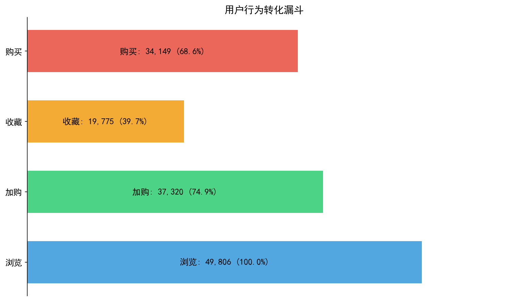

**每日转化率趋势：**

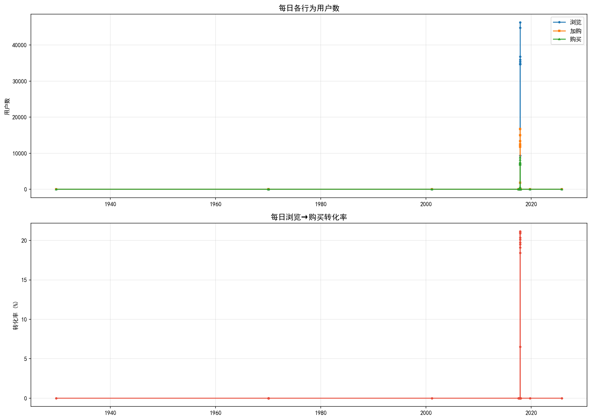

**分时段转化率：**

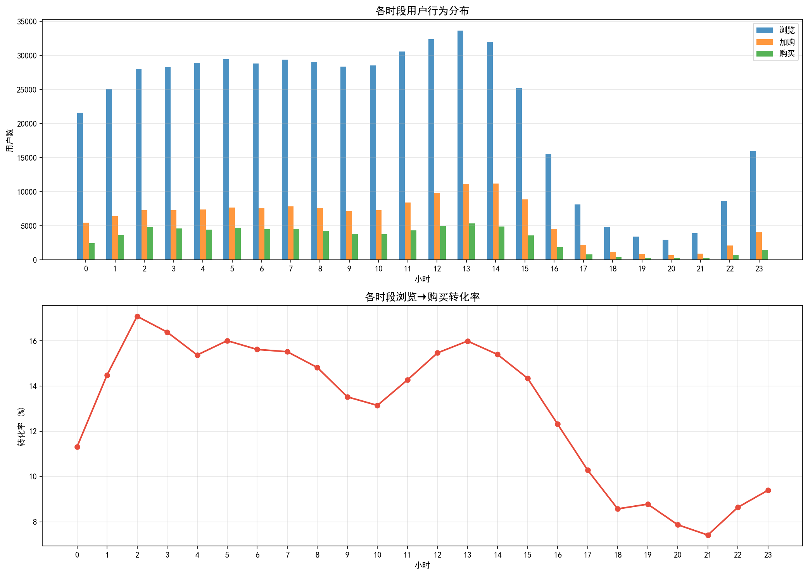

**Top 10 高转化品类：**

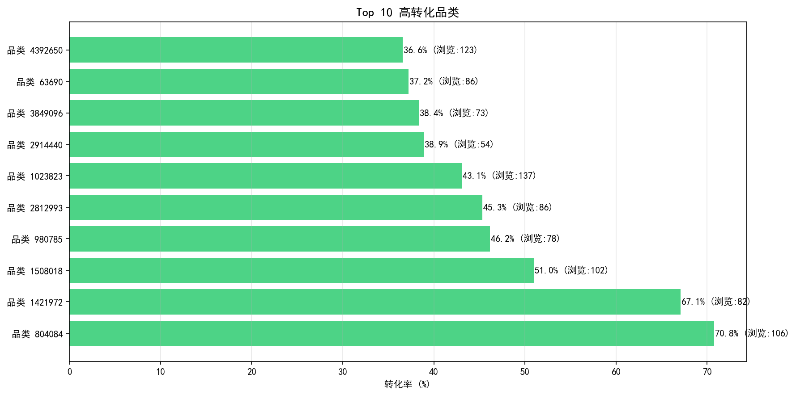

**关键发现：**
- 浏览→购买整体转化率：68.24%
- 最大流失环节：浏览→收藏（转化率仅 39.46%）
- 加购→购买转化率较高（72.22%），说明加购用户购买意愿强
- 收藏→购买转化率 71.33%，收藏也是有效的转化信号

### 3.2 RFM 用户分群

**RFM 指标统计（34,149 购买用户）：**
| 指标 | 均值 | 中位数 | 最大值 |
|------|------|--------|--------|
| R (最近购买天数) | 3.55 天 | 3 天 | 9 天 |
| F (购买频率) | 3.02 次 | 2 次 | 175 次 |
| M (购买商品数) | 2.88 个 | 2 个 | 120 个 |

**基于 RFM 评分的用户分群：**

| 用户群体 | 用户数 | 占比 | R均值 | F均值 | M均值 |
|---------|-------|------|-------|-------|-------|
| 高价值用户 | 6,164 | 18.05% | 1.81 | 7.27 | 6.84 |
| 潜力用户 | 9,897 | 28.98% | 2.56 | 3.27 | 3.14 |
| 一般用户 | 8,240 | 24.13% | 3.88 | 1.86 | 1.79 |
| 流失风险用户 | 9,848 | 28.84% | 5.37 | 1.08 | 1.06 |

**K-Means 聚类结果（K=4）：**

| 聚类 | 用户数 | 平均R | 平均F | 平均M | 特征 |
|------|--------|-------|-------|-------|------|
| 聚类 0 | 17,885 | 2.20 | 2.22 | 2.15 | 近期低频用户 |
| 聚类 1 | 10,363 | 6.71 | 1.75 | 1.70 | 流失风险用户 |
| 聚类 2 | 527 | 1.76 | 17.42 | 16.03 | 高价值活跃用户 |
| 聚类 3 | 5,374 | 2.16 | 6.74 | 6.33 | 中等活跃用户 |

**RFM 用户分群分布：**

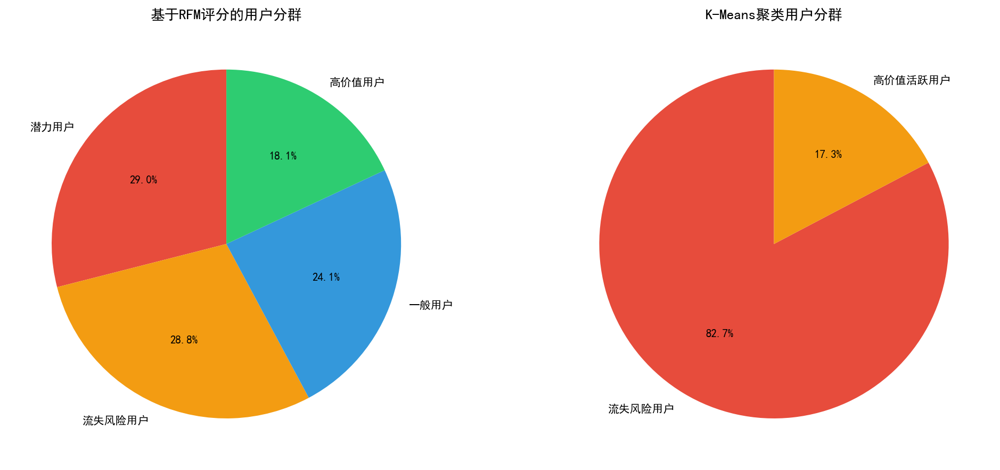

**Recency vs Frequency 散点图：**

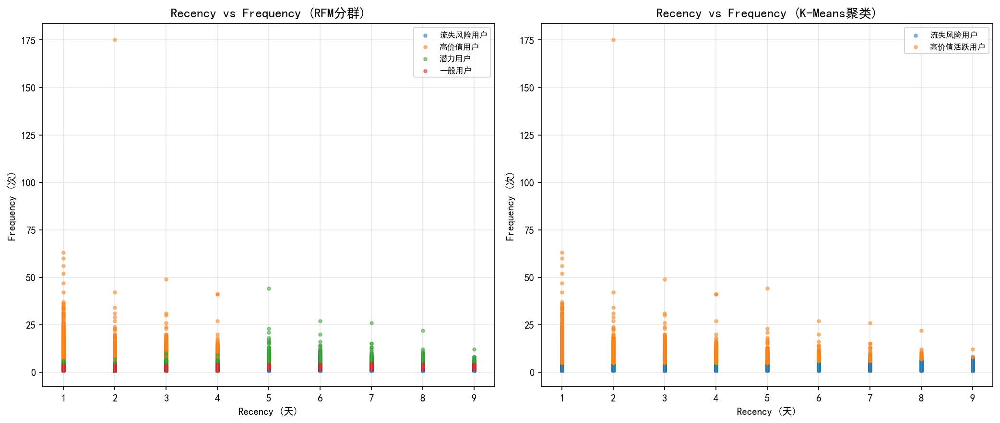

**各分群 RFM 指标箱线图：**

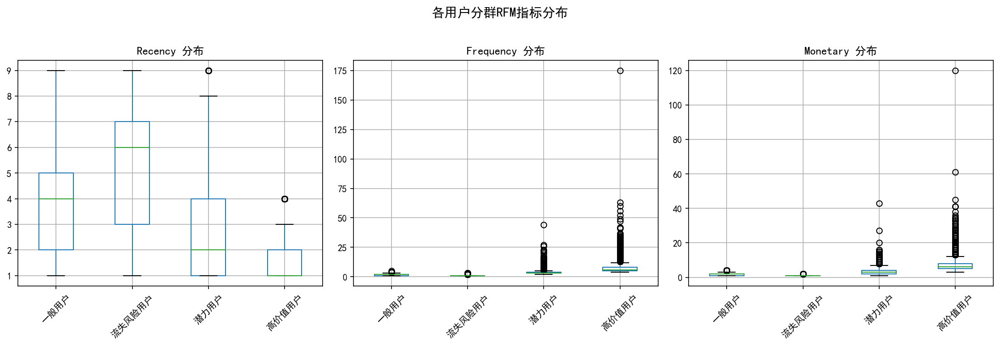

### 3.3 用户留存分析

**日留存率（按首次购买日期）：**

| 首次购买日期 | 次日留存 | 3日留存 | 7日留存 |
|-------------|---------|--------|--------|
| 2017-11-24 | 30.4% | 25.0% | 24.5% |
| 2017-11-25 | 23.2% | 19.9% | 23.0% |
| 2017-11-26 | 22.8% | 19.6% | 20.4% |
| 2017-11-27 | 19.3% | 19.0% | - |
| 2017-11-28 | 19.3% | 17.2% | - |
| 2017-11-29 | 18.9% | 17.7% | - |
| 2017-11-30 | 17.1% | 16.9% | - |
| 2017-12-01 | 20.6% | - | - |
| 2017-12-02 | 17.8% | - | - |

**用户留存率热力图：**

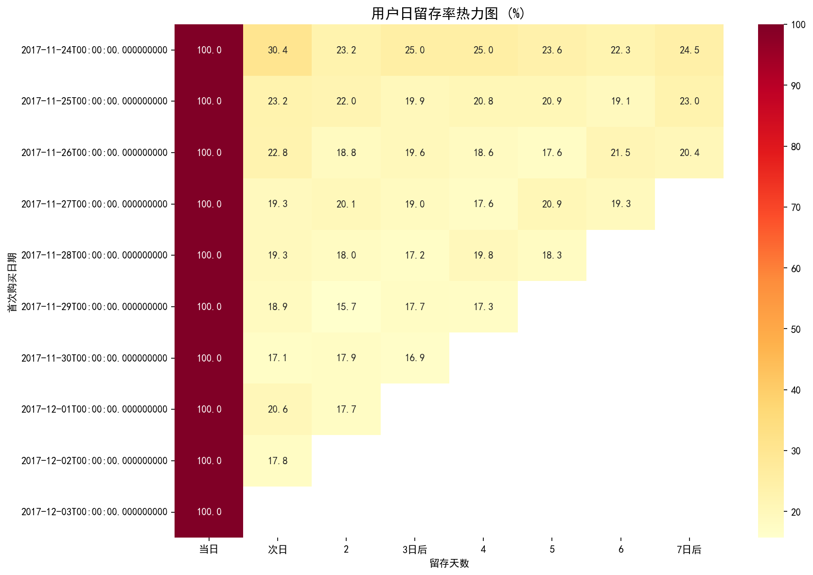

**关键发现：**
- 次日留存率：17.1% - 30.4%，平均约 20%
- 7日留存率：20% - 24.5%
- 11月24日的次日留存率最高（30.4%），可能与周末效应有关
- 整体留存率偏低，需加强用户粘性运营

### 3.4 趋势分析

**每日行为趋势：**

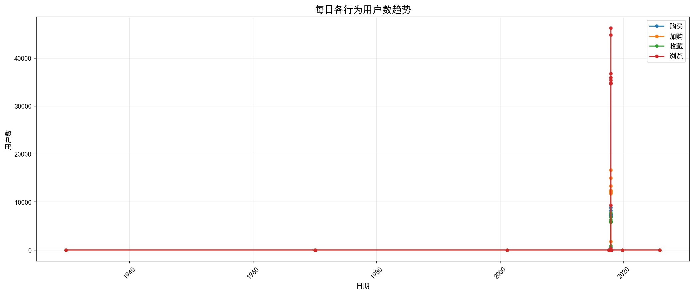

**星期几行为分布：**

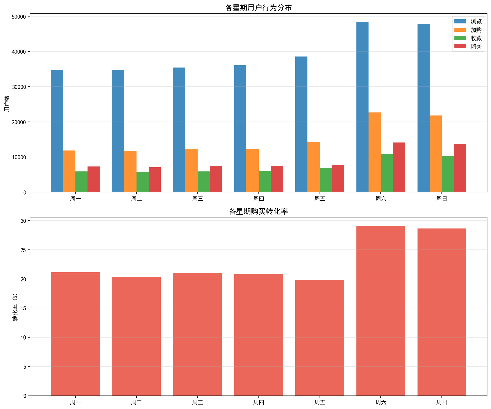

**购买用户数趋势预测：**

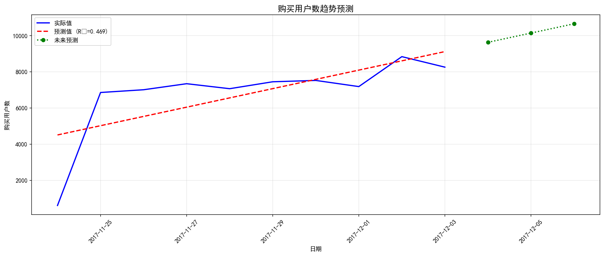

**用户活跃度分布：**

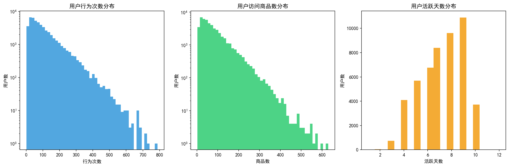

**线性回归预测模型：**
- R² Score: 0.4694
- MAE: 1146.18
- 趋势斜率: +512.37 用户/天（购买用户数呈上升趋势）

## 4. 业务建议

### 4.1 提升转化率
1. **优化浏览→收藏环节**：这是最大流失点（转化率仅 39.46%），建议优化收藏按钮位置、增加收藏引导
2. **强化加购→购买环节**：通过限时优惠、库存紧张提示促进购买决策
3. **高峰时段运营**：在转化率高的时段加大推广力度

### 4.2 用户运营策略
| 用户群体 | 特征 | 运营策略 |
|---------|------|---------|
| 高价值用户 | R低、F高、M高 | VIP维护、专属优惠、优先客服 |
| 潜力用户 | 中等水平 | 个性化推荐、复购激励 |
| 一般用户 | R高或F低 | 优惠券发放、限时活动 |
| 流失风险用户 | R高、F低、M低 | 召回短信、流失预警 |

### 4.3 提升留存率
- 次日留存率仅 20% 左右，需加强新用户引导
- 7日留存率相对稳定，说明留存用户粘性较好
- 建议在用户购买后 24 小时内推送个性化推荐，提升回访率

## 5. 技术实现

### 5.1 技术栈
- **Python**：数据预处理、RFM建模、K-Means聚类、趋势分析
- **SQL**：数据清洗、漏斗分析、路径分析
- **Tableau**：可视化看板搭建

### 5.2 关键代码
详见项目中的 Jupyter Notebook 和 SQL 脚本：
- `notebooks/01_data_preprocessing.ipynb` - 数据预处理
- `notebooks/02_funnel_visualization.ipynb` - 漏斗分析
- `notebooks/03_rfm_segmentation.ipynb` - RFM用户分群
- `notebooks/04_trend_analysis.ipynb` - 趋势分析

## 6. 附录

### 6.1 项目结构
```
├── data/                  # 数据文件
├── sql/                   # SQL分析脚本
├── notebooks/             # Jupyter Notebooks
├── src/                   # 工具函数
├── tableau/               # Tableau指南
└── report/                # 分析报告
```

### 6.2 运行说明
1. 安装依赖：`pip install -r requirements.txt`
2. 下载数据放入 `data/` 目录
3. 按顺序运行 notebooks

### 6.3 参考资料
- [阿里天池 UserBehavior 数据集](https://tianchi.aliyun.com/dataset/649)
- RFM模型理论
- K-Means聚类算法
